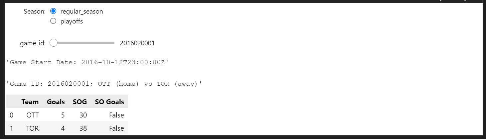
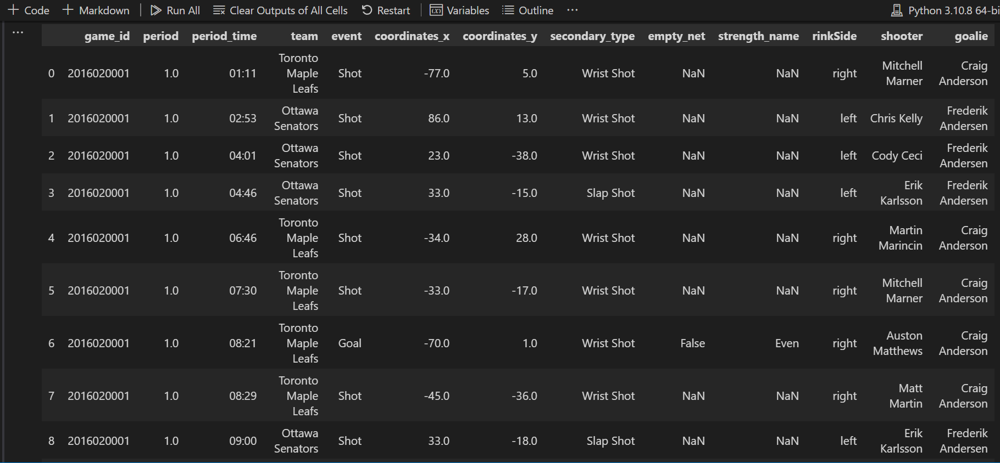
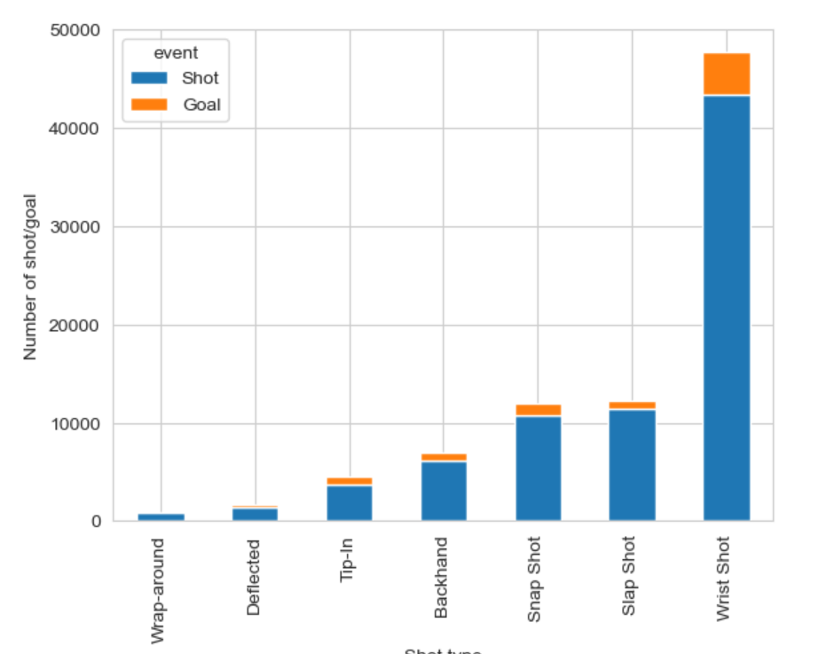
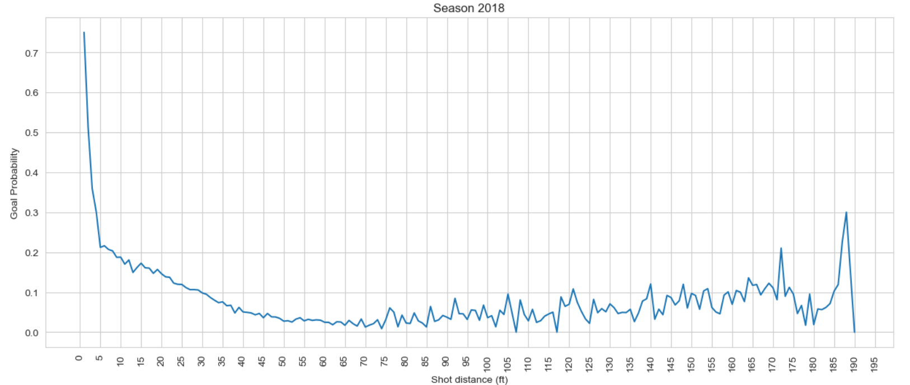
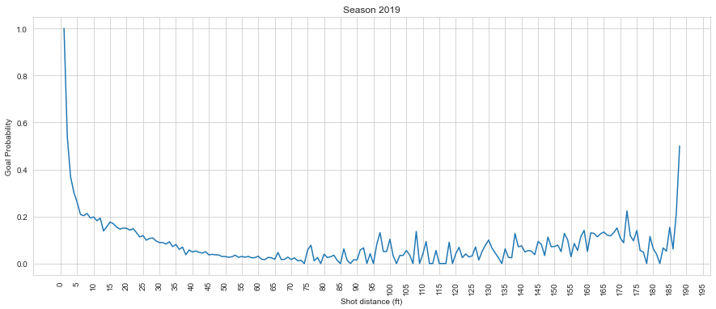
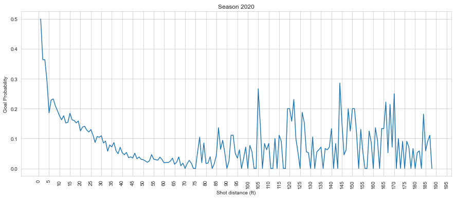

---
layout: post
title: Milestone 1
---

## Q1: Data Aquisation
The Data Aquisation code in written in the get_data.py file which consists of a few functions that I will discuss each below:

**`get_data_regular(year, file_path)`**

This function takes as input a year representing a season and a file path and downloads all the liveData and GameData events of the regular season in the file_path.
It first checks whether the data for the requested season exists or not: If it is already downloaded in the file_path, it will just load it. Else it will start downloading the data.
### How does it download the requested data?

 1. First we need to specify the GAME_ID in the following URL to be able to download the data:
 https://statsapi.web.nhl.com/api/v1/game/[GAME_ID]/feed/live/

	We know that GAME_ID for a regular season is created like this:
	4 digits for the season year + 02 + 4 digits for specific game number.
So the first game of the season 2016-2017 will have GAME_ID of 2016020001.

	This is how we create the GAME_ID in this function:

	    GAME_ID = "{}02{:04d}".format(year, i)

	i is specific number of the game.

	Using this, we can create the GAME_IDs for each season and we only need to increase the GAME_ID by 1 to go to the next game.

	#### When do we know if we have downloaded all the games?

	We stop downloading data from a given season when we reach a GAME_ID that has no liveData in its URL. It means that game is not available, and so other game s with higher GAME_IDs will not be available as well.

 2. Now that we know what GAME_ID to use, we will start downloading.
Using the GAME_ID we have, we can substitude it in the URL we have:

		`url='https://statsapi.web.nhl.com/api/v1/game/{}/feed/live/'.format(GAME_ID)`

	We can now download the data in this URL using the ***request*** library and save it as a json file.

		r = requests.get(url).json()

	This way we can have all the data in the url in r.

 3. In this part we can check to see whether liveData exists for this 			GAME_ID or not.  As said before, if it doesnt, we should end our downloading. But if it does, we save the data in a dictionary called **all_regular_games** with the key being GAME_ID.

	 We dont save all the r data we have as we don't need many parts. We just save gameData and liveData from each valid url and save them as in a dictionary called **regular_game** as below:

		regular_game['gameData'], regular_game['liveData'] = r['gameData'], r['liveData']
	Them we add this dictionary as value of the GAME_ID key to our main dictionary called **all_regular_games**:

	    all_regular_games[GAME_ID] = regular_game

At the end when we finish downloading all we needed, we now have all the data in **all_regular_games** dictionary.
Now we should just save this data in a json file using **json** library.

    with open(file_path, 'w') as f_regular:
	    json.dump(all_regular_games, f_regular)

The second function works the same as the first function, but it downloads the data for the playoff games.

**`def get_data_playoffs(year, file_path)`**

All the steps for this function is the same as the **get_data_regular** function. But there is a little difference in the way we compute GAME_ID which i will discuss below:
We know that GAME_ID for a playoff game is created like below:

4 digits for the season year + 030 + 3 digits for specific number of the game.
Specific number of the game is created like this:
1 digit for the round of the playoffs + 1 digit for the matchup + 1 digit for the game (out of 7)
So the first game of the first matchup of the first round of the season 2016-2017 will have GAME_ID of 2016030111

We know that there are 4 rounds in each playoff. So the first digit of the specific game number will be from 1 to 4.
We also know that in the first round we will have 16 teams to compete. So there will be 8 matchups(2^(4-1)).
Then for the second round we have 8 teams to compete. So there will be 4 matchups(2^(4-2)).
For the thirds and forth round we have 4 and 2 teams respectively ans therefore there will be 2 matchups for the third round(2^(4-3)) and 1 matchup for the last round(2^(4-4)).
So we can define the maximum number of matchups available for each round as below:

    2 ** (4 - number of round)

  So this way we can specify the range available for the second digit of our specific game number to be from 1 to (2 ** (4 - number of round)).

Finally we know that maximum number of the games in each matchup is 7. So the third digit in the specific game number will be from 1 to 7.

Now we can easily make GAME_IDs for a playoff game and download their URL like before:
 We should just go through a for loop from **1 to 4 as the round number**(for the first digit of the specific game number), and have another for loop **from 1 to (2 ** (4 - number of round)) for number of the matchup** (the second digit of the specific game number) and the last loop **from 1 to 7 specifying number of the game** in that matchup( third digit of the specific game number). In side the third loop we will create the GAME_ID and the url like below:

    GAME_ID = '{}030{}{}{}'.format(year, p_round, match_up, game)
	url = 'https://statsapi.web.nhl.com/api/v1/game/{}/feed/live/'.format(GAME_ID)

p_round is the round number, match_up is the matchup number and game is the game number in that matchup.

We can now download our data using **request** library and if the liveData exists, we save the data in the dictionary format explained before(we will save data in **all_playoff_games** dictionary). If not, we will skip saving and will move on to the next itereation available.

At the final step we save the **all_playoff_games** to a json file like before.

Now we just need a main function to make everything work together

    main()

  We specify the following variables:

 - path: is the path where our downloaded files will be saved
 - year: is the start year
 - to_year: is the last year

  So when we want to download data of the years 2016 to 2021 we should specify year = 2019 and to_year = 2021.

  Then in a for loop in the range of (year, to_year+1) we call :
  We make a name for the our output file.
  For regular season data in year "y" we have this name:

    file_path_regular = path + "/" + str(y) + "_regular_season.json"
 And for a playoff game data in the year "y" it will be:

    file_path_playoff = path + "/" + str(  y) + "_playoffs.json"
And at the last step we call the 2 functions we wrote:

    get_data_playoffs(y, file_path_playoff)
    get_data_regular(y, file_path_regular)

## Q2: Interactive Debugging Tool

<!--Combined Image of whole ipywidgets-->

The image above displays the interactive ipywidget tool to extract information using the following:
- The Season can be shifted between "Playoffs" and "Regular season" using radiobutton.
- Based on the season selected, the gameId IntSlider values change and hence you can slide to see the information about that particular gameId. The information includes Game start date , game Id , which two teams are playing, Goals, Shot On Goals and SO Goals.
- Based on the gameId, the slider value of the eventId changes.
- According to the eventId selected, we plot the x and y coordinates of the event on the ice rink.
- The rest of the information<!--Include the information required--> is displayed according to the selected event id.

## Q3: Tidy Data

**Question 1: In your blog post, include a small snippet of your final dataframe (e.g. using head(10)). You can just include a screenshot rather than fighting to get the tables neatly formatted in HTML/markdown.**

**Solution:** 
<!--Insert the image when the code is complete clean, Adding an example for now.-->
The final dataframe after tidying the data is as follows:

**Q2. You’ll notice that the “strength” field (i.e. even, power play, short handed) only exists for goals, not shots. Furthermore, it doesn’t include the actual strength of players on the ice (i.e. 5 on 4, or 5 on 3, etc). Discuss how you could add the actual strength information (i.e. 5 on 4, etc.) to both shots and goals, given the other event types (beyond just shots and goals) and features available. You don’t need to implement this for this milestone.**

**Solution:** 
The actual strength information can be added to both shots and goals by using the following features using Penalty events: 
1.	penaltyMinutes - The number of penalty minutes for the penalty.
2.	penaltySeverity - The severity of the penalty.
3.	penaltyType - The type of penalty. \
The penaltyMinutes can be used to determine strength by the following formula: \
Strength = 5 - penaltyMinutes \
The penaltySeverity can be used to determine strength by the following formula: \
Strength = 5 - penaltySeverity \
The penaltyType can be used to determine strength by the following formula: \
Strength = 5 - penaltyType \
Hence,\
The strength of the players on the ice can be determined by the following formula: \
Strength = 5 - (penaltyMinutes + penaltySeverity + penaltyType) \
Where 5 is the maximum strength of the players on the ice. \
These can be used to determine the strength of the players on the ice. The strength of the players on the ice can be determined by the following: 
- 5 on 5: No penalties
- 5 on 4: 1 penalty
- 5 on 3: 2 penalties
- 4 on 5: 1 penalty
- 4 on 4: 2 penalties
- 4 on 3: 3 penalties
- 3 on 5: 2 penalties
- 3 on 4: 3 penalties
- 3 on 3: 4 penalties

**Q3. In a few sentences, discuss at least 3 additional features you could consider creating from the data available in this dataset. We’re not looking for any particular answers, but if you need some inspiration, could a shot or goal be classified as a rebound/shot off the rush (explain how you’d determine these!) ?**

**Solution:**

## Q4: Simple Visualization

**Q1. Produce a figure comparing the shot types over all teams (i.e. just aggregate all of the shots), in a season of your choosing. Overlay the number of goals overtop the number of shots. What appears to be the most dangerous type of shot? The most common type of shot? Why did you choose this figure? Add this figure and discussion to your blog post.**

**Solution:**

- The most dangerous type of shot is the **Tip-in** which is followed by **Snap Shot** because it shows the maximum number of goals. 
- The most common type of shot is the **wrist shot** as it can be depicted from the graph that it has maximum number of shots in comparison to other shot types. 
- I chose this figure because it shows the number of goals and shots for each shot type in a season. This figure can be used to determine the most dangerous and common type of shot in a season. This could be used to determine the strategy of the team to play in a season.

**Q2. What is the relationship between the distance a shot was taken and the chance it was a goal? Produce a figure for each season between 2018-19 to 2020-21 to answer this, and add it to your blog post along with a couple of sentences describing your figure. Has there been much change over the past three seasons? Why did you choose this figure?**

**Solution:**

- The relationship between the distance a shot was taken and the chance it was a goal is that the closer the shot is to the goal, the higher the chance of it being a goal. That means it is inversely proportional. 
- There has not been much difference in this relationship over the past three seasons. All the graphs are almost similar depicting the same relationship. This shows that making a goal to a farther distance is not easy and hence, the team should focus on making a goal to a closer distance.
- I chose this figure so that the relationship between the distance a shot was taken and the chance it was a goal can be depicted. 

**Q3. Combine the information from the previous sections to produce a figure that shows the goal percentage (# goals / # shots) as a function of both distance from the net, and the category of shot types (you can pick a single season of your choice). Briefly discuss your findings; e.g. what might be the most dangerous types of shots?**

**Solution:**

## Q4: Advanced Visualizations: Shot Maps

**Q1. Export the 4 plot offensive zone plots to HTML, and embed it into your blog post. Your plot must allow users to select any team during the selected season.**
**Solution:** <!--HTML Embedded Link-->

**Discuss (in a few sentences) what you can interpret from these plots.**
**Solution:** 