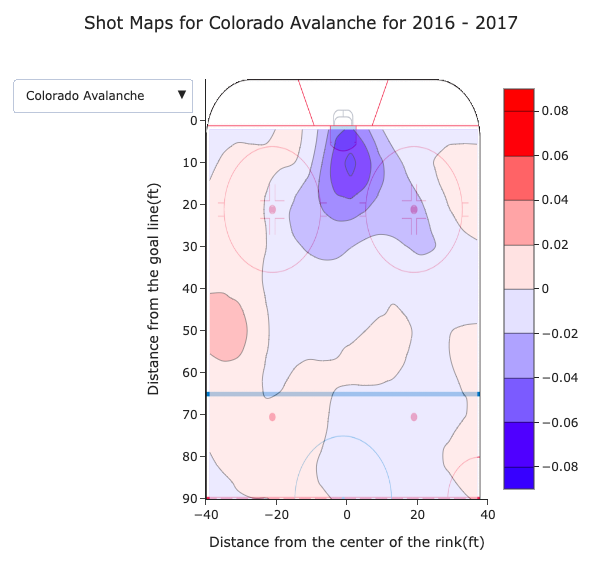
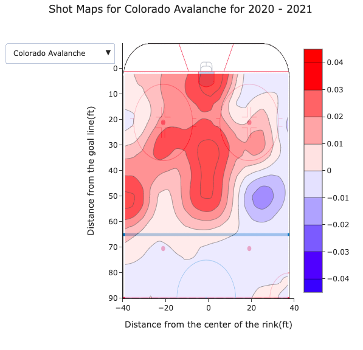

## <span style="color:SlateBlue;">Q1: Data Aquisation</span>
The Data Aquisation code in written in the **get_data.py** file consists of a few functions that I will discuss below:

**`get_data_regular(year, file_path)`**

This function takes **year as the input** representing a season and **a file path** which helps to download all the liveData and GameData events of the regular season in the file_path.
It first checks whether the data for the requested season exists or not: If it is already downloaded in the file_path, it will just load it. Else it will start downloading the data.

### How does it download the requested data?

 1. First we need to specify the **GAME_ID** in the following URL to be able to download the data:
 https://statsapi.web.nhl.com/api/v1/game/[GAME_ID]/feed/live/

	We know that GAME_ID for a regular season is created like this:
	4 digits for the **season year** + **02** + 4 digits for **specific game number.** \
So the first game of the season 2016-2017 will have GAME_ID of 2016020001.

	This is how we create the GAME_ID in this function:
	```python
	    GAME_ID = "{}02{:04d}".format(year, i)
	```

	where i is **specific number of the game.**

	Using this, we can create the GAME_IDs for each season and we only need to increase the GAME_ID by 1 to go to the next game.

	**When do we know if we have downloaded all the games?**

	We stop downloading data from a given season when we reach a GAME_ID that has no liveData in its URL. It means that game is not available, and so other games with higher GAME_IDs will not be available as well.

 2. Now that we know what GAME_ID to use, we will start downloading.\
Using the GAME_ID we have, we can substitute it in the URL we have:
	```python
		url='https://statsapi.web.nhl.com/api/v1/game/{}/feed/live/'.format(GAME_ID)
	```

	We can now download the data in this URL using the ***request*** library and save it as a json file.

	```python
		r = requests.get(url).json()
	```

	This way, we can have all the data in the url in the **r** variable.

 3. In this part we can check to see whether liveData exists for this GAME_ID or not.  As said before, if it doesnt, we should end our downloading. But if it does, we save the data in a dictionary called **all_regular_games** with the key being GAME_ID.

	 We dont save all the data stored in **r** as we don't need many parts. We just save gameData and liveData from each valid url and save them in a dictionary called **regular_game** as below:

		regular_game['gameData'], regular_game['liveData'] = r['gameData'], r['liveData']
	Them, we add this dictionary as value of the GAME_ID key to our main dictionary called **all_regular_games**:

	```python
	    all_regular_games[GAME_ID] = regular_game
	```

At the end when we finish downloading all we needed, we now have all the data in **all_regular_games** dictionary.
Now we should just save this data in a json file using **json** library.

```python
	with open(file_path, 'w') as outfile:
		json.dump(all_regular_games, outfile)
```


The second function works the same as the first function, but it downloads the data for the playoff games.

**`def get_data_playoffs(year, file_path)`**

All the steps for this function are the same as the **get_data_regular** function. But there is a little difference in the way we compute GAME_ID which i will discuss below: 

We know that GAME_ID for a playoff game is created as follows: 4 digits for **the season year** + **030** + 3 digits for **specific number of the game**, where **Specific number of the game** is created like this: 

**1 digit for the round of the playoffs + 1 digit for the matchup + 1 digit for the game (out of 7)**
    
So the first game of the first matchup of the first round of the season 2016-2017 will have GAME_ID of 2016030111. 

We know that there are 4 rounds in each playoff. So the first digit of the specific game number will be from 1 to 4.
We also know that in the first round we will have **16 teams competing**. So there will be 8 matchups(2^(4-1)). \
Then for the second round we have **8 teams competing**. So there will be 4 matchups(2^(4-2)). \
For the thirds and forth round we have 4 and 2 teams respectively and therefore there will be 2 matchups for the third round(2^(4-3)) and 1 matchup for the last round(2^(4-4)). \
So we can define the maximum number of matchups available for each round as below:

    2 ** (4 - number of round)

  So this way we can specify the range available for the second digit of our specific game number to be from 1 to (2 ** (4 - number of round)).

Finally we know that maximum number of the games in each matchup is 7. So the third digit in the specific game number will be from 1 to 7.

Now we can easily make GAME_IDs for a playoff game and download their URL like before:
 We should just go through a for loop from **1 to 4 as the round number**(for the first digit of the specific game number), and have another for loop **from 1 to (2 ** (4 - number of round)) for number of the matchup** (the second digit of the specific game number) and the last loop **from 1 to 7 specifying number of the game** in that matchup( third digit of the specific game number). In side the third loop we will create the GAME_ID and the url like below:

```python
    GAME_ID = '{}030{}{}{}'.format(year, p_round, match_up, game)
	url = 'https://statsapi.web.nhl.com/api/v1/game/{}/feed/live/'.format(GAME_ID)
```

p_round is the round number, match_up is the matchup number and game is the game number in that matchup.

We can now download our data using **request** library and if the liveData exists, we save the data in the dictionary format explained before (we will save data in **all_playoff_games** dictionary). If not, we will skip saving and will move on to the next itereation available.

At the final step we save the **all_playoff_games** to a json file like before.

Now we just need a main function to make everything work together
```python
    main()
```
  We specify the following variables:


 - path: is the path where our downloaded files will be saved
 - year: is the start year
 - to_year: is the last year

  So when we want to download data of the years 2016 to 2021 we should specify year = 2016 and to_year = 2021.

  Then in a for loop in the range of (year, to_year+1) we call : \
  We make a name for the our output file. \
  For regular season data in year "y" we have this name:
```python
    file_path_regular = path + "/" + str(y) + "_regular_season.json"
```
 And for a playoff game data in the year "y" it will be:

```python
    file_path_playoff = path + "/" + str(  y) + "_playoffs.json"
```
And at the last step we call the 2 functions we wrote:
```python
    get_data_playoffs(y, file_path_playoff)
    get_data_regular(y, file_path_regular)
```

### An Example
I want to get the data of the seasons 2016-17 to 2020-21 and i want to store the downloaded data in a folder called "get data". The following picture shows what my 3 arguments should be set to before i run the code:
**year** and **to_year** arguments must be defined as an **integer** and **path** must be defined as an **string**.


The image below shows how my output files are going to be stored in "get data" path:


## <span style="color:SlateBlue;">Q2: Interactive Debugging Tool</span>

<!--Combined Image of whole ipywidgets-->


The image above displays the interactive ipywidget tool to extract information using the following:
- The Season can be shifted between "Playoffs" and "Regular season" using radiobutton.
- Based on the season selected, the gameId IntSlider values change and hence you can slide to see the information about that particular gameId. The information includes Game start date , game Id , which two teams are playing, Goals, Shot On Goals and SO Goals.
- Based on the gameId, the slider value of the eventId changes.
- According to the eventId selected, we plot the x and y coordinates of the event on the ice rink.
- The eventsId provides the information about the specific event selected.

The code of the ipywidgets is as follows:

```python
```


## <span style="color:SlateBlue;">Q3: Tidy Data</span>

**Question 1: In your blog post, include a small snippet of your final dataframe (e.g. using head(10)). You can just include a screenshot rather than fighting to get the tables neatly formatted in HTML/markdown.**

**Solution:**
<!--Insert the image when the code is complete clean, Adding an example for now.-->
The final dataframe after tidying the data is as follows:


**Q2. You’ll notice that the “strength” field (i.e. even, power play, short handed) only exists for goals, not shots. Furthermore, it doesn’t include the actual strength of players on the ice (i.e. 5 on 4, or 5 on 3, etc). Discuss how you could add the actual strength information (i.e. 5 on 4, etc.) to both shots and goals, given the other event types (beyond just shots and goals) and features available. You don’t need to implement this for this milestone.**

**Solution:**


There are some rules regarding the strength of teams:

We can use the duration of the penalty and the penalty type to specify the duration in which a player will be out of the game. We know that when a player gets penalty
and is out of the game, the strength of the teams will change. For instance, if only 1 player is out of the game for 2 minutes, then during that 2 minutes the strength
will be 5 on 4.

Using the fields **penaltyMinutes** and **penaltyType** we can extract the duration of the penalty and the type of penalty. Using that and using the penalty rules in
an NHL game we can specify the strengths in all the plays.

We can find the penaltyPlays in **liveData/plays/penaltyPlays**
and then we can see the information regarding each play in **liveData/plays/allPlays**. Then choosing the play number, we can go to **results** section to see the
**penaltyMinutes** and **penaltyType** fields we need and by going to **about/name** section we can see which team has got the penalty.

There are a few rules regarding the penalty durations such as:

- When the penalty is a minor type, the player will go out of the game for a period of 2 minutes. He will be able to come back to the ice when this period is over OR when the opponent team scores a goal.
- When the penalty is a major type, the player will go out of the game for a period of 5 minutes. He will be able to come back to the ice when this period is over.
- When the penalty is a double minor or triple minor the the player will go out of the game for a period of 4 or 6 minutes respectively.
 He will be able to come back to the ice when this period is over. Each time the opponent team scores a goal, the remaining penalty period will be reduced to the first multiple of 2 less than the remaining time. for example if the remaining time is 3:45, it will be reduced to 2:00.

- There are also some cases in which 2 teams might get penalty at the same time. There are some rules regarding these situations, for example in some cases, the teams can substitute the players . In this case there will be no change to the strength.
- Another case will be when a team already has 2 players in the penalty box, and another player gets a penalty as well. The team can not have less than 2 players, so they will get a delayed penalty. Let's assume a game with current strength of 5 on 3 and the team with 3 players, gets another penalty. The 3rd player will not leave the game, but when the penalty time for the first player is over, he will not be able to enter the ice[(Reference)](https://hockeyanswered.com/can-you-have-a-5-on-2-in-hockey/#:~:text=If%20a%20team%20takes%20a,situations%20behind%20this%20more%20closely.)
 When the time for 2nd player is over, he can enter the ice and therefore the strength will change to 5 on 4. Now the first player can enter the ice ofter the first stoppage after his penalty time is over. (We can find if a stoppage has happened through **results/event** section in allPlays data)

These were some of the most important rules regarding the penalties in a hockey game. Using them we can define our code to reduce the strength of the team getting a penalty and again increasing it when the condition for that penalty is fulfilled and the penalty is over.


**Q3. In a few sentences, discuss at least 3 additional features you could consider creating from the data available in this dataset. We’re not looking for any particular answers, but if you need some inspiration, could a shot or goal be classified as a rebound/shot off the rush (explain how you’d determine these!) ?**

**Solution:**

Several features that can be created from the data available in this dataset as we discussed are as follows:

1. **Shot Off Rush**: These are the shots that can be taken within the 4 uninterrupted seconds of the game and the previous events should be within the neutral or defensive zone. For this, we can use the **event** field in the **allPlays** section of the data. If the **event** field is **Shot** and the **periodTime-previousPeriodTime** is less than 4 seconds, then we can say that its a  shot off the rush. If the **result** field is **Missed Shot** or **Blocked Shot** or **Saved Shot**, then we can say that its a shot off the rush. We also need to check if there was a stoppage between those 4 seconds. If there was a stoppage, then we can say that its not a shot off the rush. We can find if a stoppage has happened through **results/event** section in allPlays data.

2. **Rebound**: The rebound would be considered a shot being hit towards the goal and only a goalie or blocking defender would be able to rebound the shot. So, there would be a shot and then a save. We can find the **event** field in the **allPlays** section of the data. If the **event** field is **Shot** and the next **event** field is **Save**, then we can say that its a rebound. We also need to check if there was a stoppage between these two events. If there was a stoppage, then we can say that its not a rebound. We can find if a stoppage has happened through **results/event** section in allPlays data. Hence, we can have a boolean value for the rebound. 

3. **Odd Man Rush**: When the number of attackers entering the zone are more than the number of defenders, then it is called an odd man rush. As we have number of players information for each goal in the dataset provided, it is easier to find the odd man rush for goals as a boolean value .But, if we look at the areas, offensive or defensive zones, we cannot find out this value because the data of players playing in which zone is not provided.

3. Another view is to have the players of have **hat trick** which means the player scored the goal thrice in the game. We can have a boolean value for this as well. We can find the **event** field in the **allPlays** section of the data. If the **event** field is **Goal** and the **scorer** field is the same as the **scorer** field of the previous two goals, then we can say that the player has scored a hat trick.

4. It is better to integrate the goals within the shots. Its a modification to the events which are already there. Goals should be considered as a subset of the shot and should be specified as a part of goal rather than differentiating it from the shot. 


## <span style="color:SlateBlue;">Q4: Simple Visualization</span>

**Q1. Produce a figure comparing the shot types over all teams (i.e. just aggregate all of the shots), in a season of your choosing. Overlay the number of goals overtop the number of shots. What appears to be the most dangerous type of shot? The most common type of shot? Why did you choose this figure? Add this figure and discussion to your blog post.**

**Solution:**


- The most dangerous type of shot is the **Tip-in** which is followed by **Snap Shot** because it shows the maximum number of goals realtively to the number of shots. In other words, they have the highest proportion of shots becoming goals. 
- The most common type of shot is the **wrist shot** as it can be depicted from the graph that it has maximum number of shots in comparison to other shot types.
- I chose this figure because it is easier to compare the each shot. The bar plots provide a vision that are easier to compare and understand.

**Q2. What is the relationship between the distance a shot was taken and the chance it was a goal? Produce a figure for each season between 2018-19 to 2020-21 to answer this, and add it to your blog post along with a couple of sentences describing your figure. Has there been much change over the past three seasons? Why did you choose this figure?**

**Solution:**


- The relationship between the distance a shot was taken and the chance it was a goal is that the closer the shot is to the goal, the higher the chance of it being a goal. That means it is inversely proportional.
- There has not been much difference in this relationship over the past three seasons. All the graphs are almost similar depicting the same relationship. This shows that making a goal to a farther distance is not easy and hence, the team should focus on making a goal to a closer distance.
- I chose this figure so that the relationship between the distance a shot was taken and the chance it was a goal can be depicted.

**Q3. Combine the information from the previous sections to produce a figure that shows the goal percentage (# goals / # shots) as a function of both distance from the net, and the category of shot types (you can pick a single season of your choice). Briefly discuss your findings; e.g. what might be the most dangerous types of shots?**

**Solution:**

I chose season 2018 for this question. In this figure we can see the probability of a shot being a goal given its distance from the net and its shot type.
We can see that there are some specific shots at specific distances that have always resulted in a goal:

  |Distance from net|Shot type  |
  |--|--|
  1|Wrest-shop
  1|Deflected
  |2  |Deflected
3  |Backhand
30|Wrap-around
37|Deflected
116|Tip-in
154|Deflected
157|Slap-shot
165|Deflected
170|Deflected
172|Snap-shot
182|Snap-shot

So we can say these shots from these distances were the most dangerous ones. Among these 13 situations, 6 of them are
Deflected shot and 2 of them are Snap-shot.
Also looking at the figure we can easily see that the higher lines are mostly of the colors purple and orange which are
for the shot types Snap-shot and Deflected respectively. So we can say these 2 shots are the most dangerous shots in general(in season 2018).
## <span style="color:SlateBlue;">Q4: Advanced Visualizations: Shot Maps</span>

**Q1. Export the 4 plot offensive zone plots to HTML, and embed it into your blog post. Your plot must allow users to select any team during the selected season.**

**Solution:**

The interactive plots for several years are as follows: \






**Q2 Discuss (in a few sentences) what you can interpret from these plots.**

**Solution:**

These plots allow us to visualize the raw difference in the shot rate per hour between a chosen team and the league average in each area of the offensive zone of the rink. The colours and their intensity characterize these differences: a red colouring indicates a location where the chosen team takes more shots than average in an hour, whereas blue indicates the opposite, an area where the teams takes less shots than average in an hour.

Moreover, the colours’ intensity indicates the magnitude of the difference, where the darkest shades represent areas with the greatest difference and it becomes lighter as the difference decreases.  The colour bar provides a correspondence between a colour’s shade and the value of the difference.


**Q3 Consider the Colorado Avalanche; take a look at their shot map during the 2016-17 season. Discuss what you could say about the team during this season. Now look at the shot map for the Colorado Avalanche for the 2020-21 season, and discuss what you could conclude from these differences. Does this make sense? Hint: look at the standings.**

**Solution:**


During the 2016-17 season, the biggest difference in shot rate per hour for Colorado Avalanche is observed around the goal net, where they took less shots than average. In the rest of the rink, they mainly had an average rate, and more than average on the side, especially in the left area around the offensive line that has the darkest shade of red.


During the 2020-2021 season, the left area around the offensive line is still a region where they have more shots than average, but the trends are different for all the rest of the rink. Indeed, they had more shots than average specially around the goal and in the center area of the offensive zone, and less on the right side of the rink.

The difference in the trends observed in the two season can be a factor explaining the difference in their ranking. Indeed, we have previously concluded that the most dangerous shots were the ones closest to the goal net. In 2016-17, where they shot less in this area, they were not qualified for playoffs and finished 7th in their division ranking. However, when they shot more around the goal net in 2020-21, they had a better season and played until the second round of the playoffs. Therefore, the differences in the maps for both season makes sense.

**Q4. Consider the Buffalo Sabres, which have been a team that has struggled over recent years, and compare them to the Tampa Bay Lightning, a team which has won the Stanley for two years in a row. Look at the shot maps for these two teams from the 2018-19, 2019-20, and 2020-21 seasons. Discuss what observations you can make. Is there anything that could explain the Lightning’s success, or the Sabres’ struggles? How complete of a picture do you think this paints?**

**Solution:**

During the three season, from 2018 to 2020, we can observe similar trends in the shot locations of the Buffalo Sabres. They have an average shooting rate to less than average in the majority of the rink. The biggest difference with the average rate is observed around the goal net where they mostly have less shots than average. The red areas are very small and concentrated on the left and right edges of the rink, 

For Tampa Bay, in the 2018-2019 and 2019-2020 seasons, they also shot less than average around the goal net, but unlike Buffalo Sabres they had more shots than average in the central area of the offensive zone. However, in 2020-2021, they had more shots than average in around the goal net, as well as in the central area of the offensive zone.

From these observations, we could hypothesize that the Buffalo Sabres struggle comes from having less than average shot rate around the goal but also in the majority of the central area of the offensive zone, since in 2018-19, even if Tampa Bay had a smaller shot rate than average around the goal they still had a better ranking than Buffalo Sabres. Therefore, what would explain Tampa Bay’s success is their shot rate around the central area of the ossensive zone and then around the goal for the last season.

However, we would need to consider other factors to try and have a full picture, like trends in the shooting location by player during these years and what type of shot they used. For example, in the 2019-2020 season, even if Tampa bay had a less than average shot rate around the goal net, they had a positive important difference on the right back side, and that could improve their ranking if they had a player who has a great success in shots from that location.
